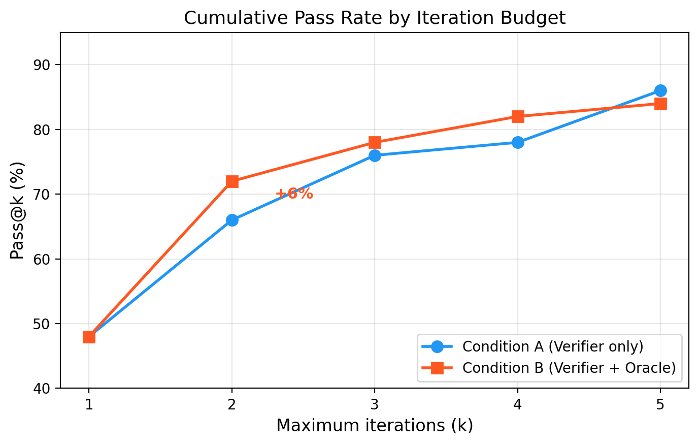
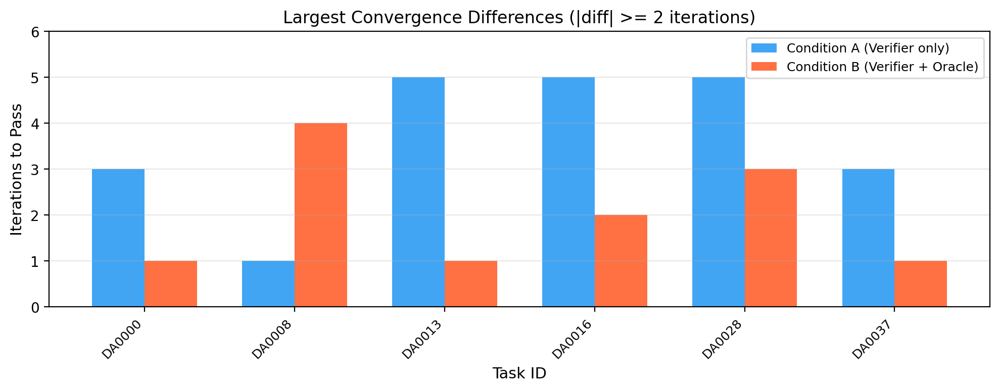
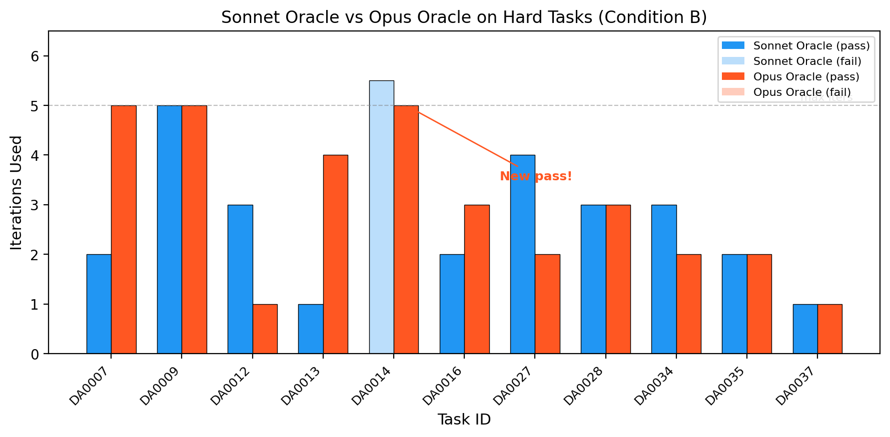

# Adversarial LLM Oracle in a Dafny CEGIS Repair Loop

**Question.** When LLM-generated Dafny code fails to verify, the standard fix is a CEGIS loop: feed the verifier error back to the model and ask for a repair. Does adding a *second* LLM as an "adversarial counterexample" oracle to the repair prompt help, and does the oracle's model tier matter?

**Conditions.** Generator is Claude Sonnet 4.6. Tasks are 50 Dafny APPStest problems (DA0000–DA0049) from the [Vericoding benchmark](https://arxiv.org/abs/2509.22908). 120s verification timeout, up to 5 repair iterations, one trial per (task, condition).

- **A.** Verifier-only feedback in the repair prompt.
- **B.** Verifier + LLM oracle that produces a concrete counterexample (input values, which postcondition clause fails). Oracle = Sonnet 4.6.
- **B-Opus.** Same as B, but the oracle is Opus 4.6. Run only on the 17 tasks that took >2 iterations under A.

**Result.**

| | pass@1 | pass@2 | pass@5 |
|---|---|---|---|
| A | 48% | 66% | **86%** (43/50) |
| B | 48% | **72%** | 84% (42/50) |
| B-Opus (17 hard tasks only) | — | — | +1 net-new-passed task (DA0014) |

DA0014 had failed under A, under B with Sonnet, and across reruns. It passed under B-Opus because the oracle named a specific missing lemma call (`GcdDividesDenominator(a-b, b)` in the else branch of `GcdDividesNumerator`); the generator's next completion added exactly that call and the proof closed.

**The null.** The aggregate A-vs-B comparison is not evidence that the oracle helps on average. Wilcoxon signed-rank on iteration count over the 42 jointly-solved tasks: p = 0.21. The +6% pass@2 is compatible with sampling noise, and the −2 pass@5 gap is one JSON-parsing failure on DA0019, not oracle-induced regression. Single-trial evidence cannot separate DA0013's 5→1 speedup from DA0008's 1→4 slowdown — same evidential status.

**Limitations.**

- One trial per (task, condition). No statistical claim about the aggregate.
- DA0014 is n=1. The "proof-engineering advice beats counterexample generation" reframe is a case study, not a demonstrated effect.
- The 50-task subset runs at 86% baseline; the full 677-task Dafny APPStest set runs at 60–67%. My subset is easier than the benchmark.
- No non-LLM counterexample baseline. I can't distinguish "any second feedback channel helps" from "LLM proof advice specifically helps."

## Longer writeups

- [`BLOG_POST.md`](BLOG_POST.md) — narrative post with the reframing, taxonomy of irreducible failures, and predictions with probabilities.
- [`SUBMISSION_DRAFT.md`](SUBMISSION_DRAFT.md) — Apart Research hackathon submission.
- [`FUTURE_WORK.md`](FUTURE_WORK.md) — planned follow-up experiments addressing each limitation above.

## Figures





## Reproducing

```bash
pip install -r requirements.txt
# Ensure Dafny is on PATH
export ANTHROPIC_API_KEY=...

# Baseline (Conditions A and B on DA0000-DA0049)
python run_experiment.py --condition A --trials 1
python run_experiment.py --condition B --trials 1

# Opus oracle on the 17 hard tasks
python run_experiment.py \
  --tasks DA0003 DA0006 DA0007 DA0009 DA0012 DA0013 DA0014 DA0016 \
          DA0023 DA0024 DA0027 DA0028 DA0034 DA0035 DA0037 DA0038 DA0043 \
  --condition B --oracle-model claude-opus-4-6 --trials 1

python analysis.py            # summary tables
python generate_figures.py    # figures 1–3 (PNG + PDF)
```

## Layout

```
run_experiment.py                    # CEGIS loop with optional oracle
analysis.py, generate_figures.py     # analysis and plotting
experiment_results/
  merged_results.csv                 # consolidated 50-task baseline
  run_20260524_194452/               # A and B (Sonnet oracle)
  run_20260524_230528/               # B-Opus on 17 hard tasks
  run_20260525_161638/               # DA0008/DA0019 rerun
vericoding/, specs/                  # upstream benchmark
```

## Upstream

The `vericoding/` submodule and `specs/` directory are from the [Vericoding benchmark](https://github.com/Beneficial-AI-Foundation/vericoding) (Bursuc et al., 2025, [arXiv:2509.22908](https://arxiv.org/abs/2509.22908)) — 12,504 tasks across Dafny, Lean, and Verus. Cite that paper if you build on this work.
